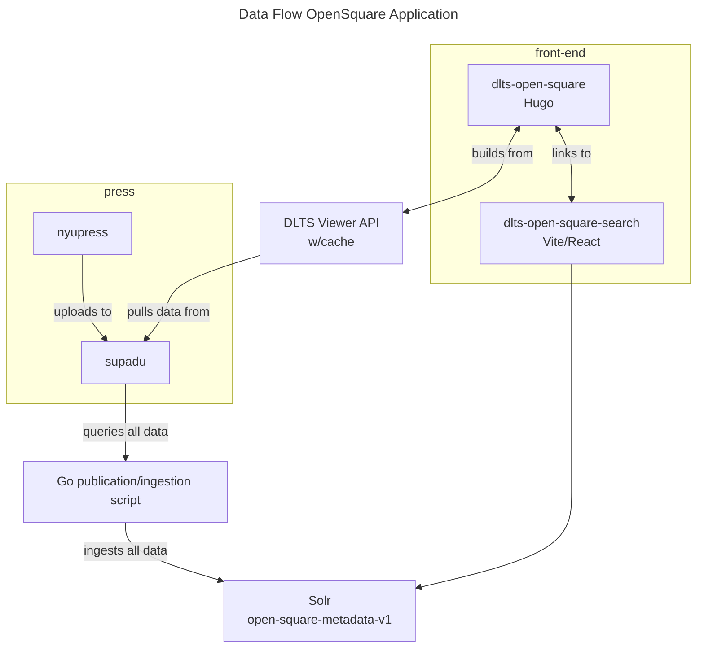
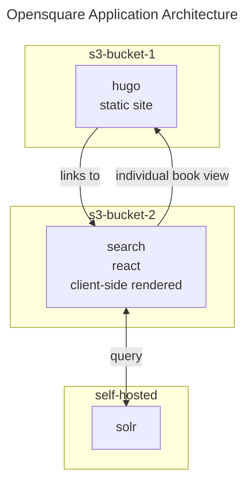
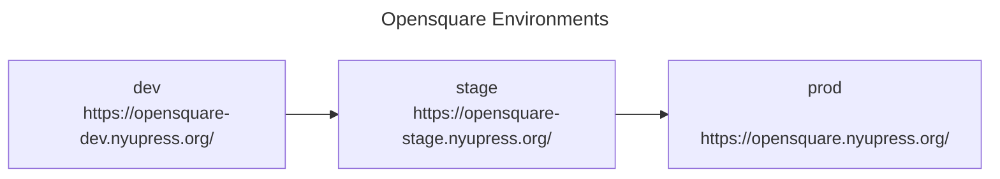

# DLTS Open Square: Search

[Metadata search application](http://opensquare.nyupress.org/search/) for the DLTS [Open Square website](http://opensquare.nyupress.org/).
A Client-side rendered application hosted on AWS S3.

Built With:

-   [Vite](https://vite.dev/)
-   [ESLint](https://eslint.org/)
-   [Prettier](https://prettier.io/)
-   [React.js](https://react.dev/)

Tested with:

-   [Vitest](https://vitest.dev/)
-   [Selenium](https://www.seleniumhq.org/) (in removal in favor of playright)
-   [WebdriverIO](https://webdriver.io/)

## Architecture






> https://mermaid.js.org/syntax/flowchart.html

### Environments



This repository follows gitflow practices, and has 3 long lived branches that represent the state of what is deployed in each stage:

TODO: this is for CONTRIBUTING and not for environments

-   Development (local and deployed)
    -   branch off `develop`
    -   ticket naming recommendation `<ticketNumber>-<SmallSummary>`
    -   (uses `.env.development` to override locally create `.env.development.local`)
    -   create PR back into development
    -   deploy to development environment
    -   search hosted at: https://opensquare-dev.nyupress.org/
    -   DLTS viewer api hosted at: https://stage-sites.dlib.nyu.edu/viewer/api/v1/search/
    -   solr hosted at: https://devdiscovery.dlib.nyu.edu/solr/#/
-   Staging (deployed)
    -   branch `staging` (uses `.env.stage`)
    -   create PRs from `development` branch as promotion of changes to Staging
    -   deploy to staging environment
    -   search hosted at: https://opensquare-stage.nyupress.org/
    -   DLTS viewer api hosted at:
    -   solr hosted at: https://stagediscovery.dlib.nyu.edu/solr/#/
-   Production (deployed)
    -   branch `main` (uses `.env.production)
    -   create PRs from `staging` branch as promotion of changes to Production
    -   deploy to production environment
    -   deploys to discovery1
    -   search hosted at: https://opensquare.nyupress.org/
    -   DLTS viewer api hosted at:
    -   solr hosted at: https://discovery.dlib.nyu.edu/solr/#/


## Project setup

### Prerequisites

-   [git](https://git-scm.com/downloads)
-   [docker desktop](docker.com)
-   [vscode](https://code.visualstudio.com)
    -   `ms-vscode-remote.remote-containers`
-   [aws cli](https://docs.aws.amazon.com/cli/latest/userguide/getting-started-install.html)
    -   will require credentials provisioned by the devops team

> Verify environment variable values with someone from the team

### Setup

We use devcontainers to setup the environment needed to develop this app.

- open project in vs-code, and then open in container.
- note all dev tools are installed within vscode, no need for configurations.

### Installing dependencies

All build steps of the devcontainer have a postInstall script that runs `npm ci`.
You should have your dependencies already in the container.

```
# use `master` branch to run what is in production
npm clean-install
```

## Development

### Branching


### Compile and hot-reload for local development

Serve development version with hot reload.
Uses environment variables from .env.development, can be overriden with a .env.development.local
```
npm run dev
```

### Lint and fix files

-   vscode + `EditorConfig.EditorConfig` extension handles indentation, whitespace, and line endings
-   vscode + `dbaeumer.vscode-eslint` uses ESLint recommendations
-   prettier on save through project vscode setting

```
npm run lint
```


### Compile and minify for each environment: development, stage, and production

> [vite modes and node_env](https://vite.dev/guide/env-and-mode.html#node-env-and-modes)

```
# Uses environment variables from .env.development
npm run build-dev

# Uses environment variables from .env.stage
npm run build-staging

# Uses environment variables from .env.production
npm run build
```

> output directory is `dist/`
> this finalized directory can be synced into AWS S3

```
# to locally serve the built artifact
npm run preview
```

## Backup and preserve a deployed site

Pre-requisites:

- aws cli

When deploying new changes to an environment you might need to backup the content in that S3 bucket.

```
npm run backup-prod
> will copy into a `./backups` directory (gitignored)
```

## Deployment

Once you have the built artifact we can sync to the correct environment with aws-cli.

Pre-requisites (not in devcontainer, needed on your development machine)

-   [aws cli](https://docs.aws.amazon.com/cli/latest/userguide/getting-started-install.html)
    -   aws cli credentials provisioned by the devops team with the following abilities:
        -   s3 bucket (write)
        -   cloudfront (invalidation)

Deploying this application requires the following actions

1. Building locally
2. using aws cli to sync the `dist/` directory into S3 (this bucket is only for the search application)
3. invalidating cache so that changes are seen immediately

```
# development environment
npm run build-dev
npm run deploy-dev
npm run cache-inv-dev

# staging environment
npm run build-stage
npm run deploy-stage
npm run cache-inv-stage

# production environment
npm run build
npm run deploy
npm run cache-inv
```

Future upgrades to this process:

-   aws cli installed within devcontainer (passing aws credential into container)
-   github actions build and push in devcontainers (no need to provision aws credentials, no sitting credentials on dev machines)
    -   pros:
        -   no need to store AWS keys locally
        -   deployment is not manual
    -   cons:
        -   price for runners if we don't have local Actions Servers
        -   TODO: look into alloted hours with enterprise accounts for Github Actions
    -   steps:
        -   store variables in secrets store
        -   use devcontainer setup for build environment
        -   create artifact
        -   aws copy and deploy
-   git tagging practices, and gitops deployments triggered by branch merges

### Run all tests

> project has been updated to use react instead of vue.js and changes to the markup have happened.
> these tests might not work entirely as they used to.

```
# Run all unit and browser tests
npm test
```

TODO: Runs tests against the newly deployed application

### Run unit tests

```
# specific test
npm test ./src/utils/utils.test.js
# TODO: add script for unit tests only
```

### Browser (e2e) tests

```
# Run Selenium tests headlessly against localhost ENM
yarn test:browser:local

# Debugging Selenium tests in Chrome only - not in headless mode
# Timeout is set to very hight value to allow for pausing at breakpoints
yarn test:browser:local:debug:chrome

# Debugging Selenium tests in Firefox only - not in headless mode
# Timeout is set to very hight value to allow for pausing at breakpoints
yarn test:browser:local:debug:firefox

# Run tests headlessly against live dev server ENM
yarn test:browser:dev

# Run tests headlessly against live staging server ENM
yarn test:browser:stage

# Run tests headlessly against live production server ENM
yarn test:browser:prod
```


