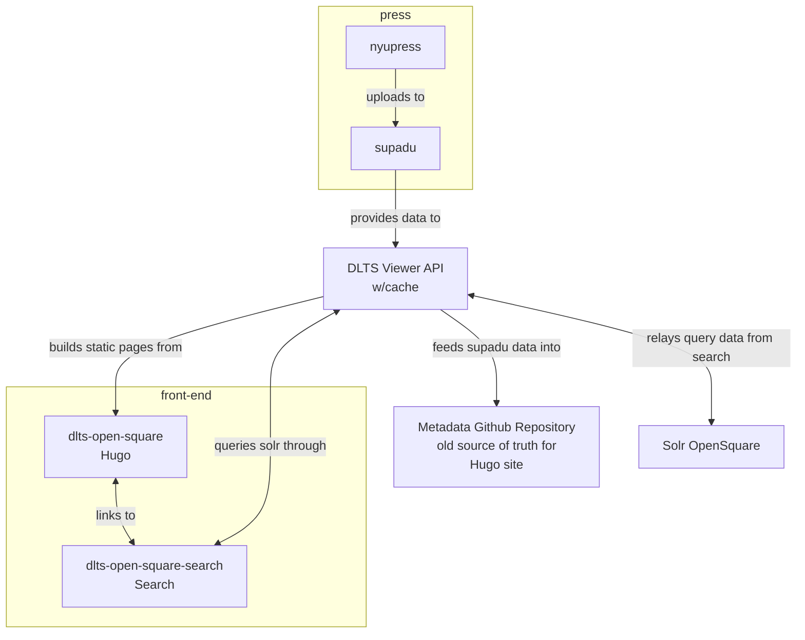
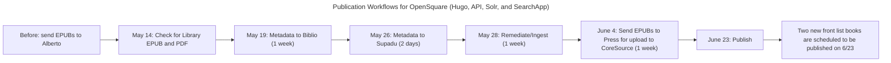
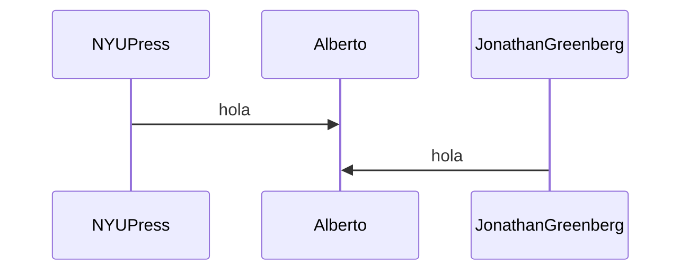

# DLTS Open Square: Search

[Metadata search application](http://opensquare.nyupress.org/search/) for the DLTS [Open Square website](http://opensquare.nyupress.org/).
A Client-side rendered application hosted on AWS S3.

Built With:

-   [Vite](https://vite.dev/)
-   [ESLint](https://eslint.org/)
-   [Prettier](https://prettier.io/)
-   [React.js](https://react.dev/)

Tested with:

-   [Vitest](https://vitest.dev/)
-   [Selenium](https://www.seleniumhq.org/) (in removal in favor of playright)
-   [WebdriverIO](https://webdriver.io/)

## Architecture

> https://mermaid.js.org/syntax/flowchart.html



### Environments

> separated under the gitops practice of Branch tips as the single source of truth for each environment.

-   Development (local and deployed)
    -   branch off `develop`
    -   ticket naming recommendation `<ticketNumber>-<SmallSummary>`
    -   (uses `.env.development` to override locally create `.env.development.local`)
    -   create PR back into development
    -   deploy to development environment
    -   search hosted at: https://opensquare-dev.nyupress.org/
    -   DLTS viewer api hosted at: https://stage-sites.dlib.nyu.edu/viewer/api/v1/search/
    -   solr hosted at: https://devdiscovery.dlib.nyu.edu/solr/#/
-   Staging (deployed)
    -   branch `staging` (uses `.env.stage`)
    -   create PRs from `development` branch as promotion of changes to Staging
    -   deploy to staging environment
    -   search hosted at: https://opensquare-stage.nyupress.org/
    -   DLTS viewer api hosted at:
    -   solr hosted at: https://stagediscovery.dlib.nyu.edu/solr/#/
-   Production (deployed)
    -   branch `main` (uses `.env.production)
    -   create PRs from `staging` branch as promotion of changes to Production
    -   deploy to production environment
    -   deploys to discovery1
    -   search hosted at: https://opensquare.nyupress.org/
    -   DLTS viewer api hosted at:
    -   solr hosted at: https://discovery.dlib.nyu.edu/solr/#/

## Project setup

### Prerequisites

-   [git](https://git-scm.com/downloads)
-   [docker desktop](docker.com)
-   [vscode](https://code.visualstudio.com)
    -   `ms-vscode-remote.remote-containers`
    -   [connecting devcontainers to docker networks](https://github.com/microsoft/vscode-remote-release/issues/4272)
        TODO: move these dependencies into .devcontainer.json

*   [Java](https://www.java.com/) (at least Java 8 recommended) - for Selenium tests
    TODO: move testing from selenium to microsoft playright

-   Verify environment variable values with someone from the team

### Setup

> open project in vs-code, and then open in container.
> note all dev tools are installed within vscode, no need for configurations.

### Installing dependencies

```
# use `main` branch
npm clean-install
```

> using the terminal within the dev container

### Compile and hot-reload for local development

```
# Serve development version with hot reload at localhost:8080
# Uses environment variables from .env.development, can be overriden with a .env.development.local
npm run dev
```

### Compile and minify for each environment: development, stage, and production

> [vite modes and node_env](https://vite.dev/guide/env-and-mode.html#node-env-and-modes)

```
# for production
npm run build
```

```
# Uses environment variables from .env.dev
npm run build-dev

# Uses environment variables from .env.stage
npm run build-staging

# Uses environment variables from .env.prod
npm run build
```

> output directory is `dist/`
> this finalized directory can be synced into AWS S3

```
# to locally serve built artifact
npm run preview
```

## Backup and preserve a deployed site

Pre-requisites

- aws cli

When deploying new changes to an environment you might need to backup the content in that S3 bucket.

```
npm run backup-prod
> will copy into a `./backups` directory
```

## Deployment

Pre-requisites (not in devcontainer, needed on your development machine)

-   [aws cli](https://docs.aws.amazon.com/cli/latest/userguide/getting-started-install.html)
-   aws cli credentials provisioned by the devops team with the following abilities:
    -   s3 bucket (write)
    -   cloudfront (invalidation)

Deploying this application requires the following actions

1. Building locally
2. using aws cli to sync the `dist/` directory into S3 (this bucket is only for the search application)
3. invalidating cache so that changes are seen immediately

```
# development environment
npm run build-dev
npm run deploy-dev
npm run cache-inv-dev

# staging environment
npm run build-stage
npm run deploy-stage
npm run cache-inv-stage

# production environment
npm run build
npm run deploy
npm run cache-inv
```

Future upgrades to this process:

-   aws cli installed within devcontainer (passing aws credential into container)
-   github actions build and push in devcontainers (no need to provision aws credentials, no sitting credentials on dev machines)
    -   pros:
        -   no need to store AWS keys locally
        -   deployment is not manual
    -   cons:
        -   price for runners if we don't have local Actions Servers
        -   TODO: look into alloted hours with enterprise accounts for Github Actions
    -   steps:
        -   store variables in secrets store
        -   use devcontainer setup for build environment
        -   create artifact
        -   aws copy and deploy
-   git tagging practices, and gitops deployments triggered by branch merges

## Infrastructure Configuration post Deployment

-   re-route of 404 page to index.html (static site with client side rendered react needs this redirect to hanlde 404 locally)
-   configure cloudfront distribution pages for error handling too

### Run all tests

> project has been updated to use react instead of vue.js and changes to the markup have happened.
> these tests might not work entirely as they used to.

```
# Run all unit and browser tests
npm test
```

TODO: Runs tests against the newly deployed application

### Run unit tests

```
# specific test
npm test ./src/utils/utils.test.js
# TODO: add script for unit tests only
```

### Browser (e2e) tests

```
# Run Selenium tests headlessly against localhost ENM
yarn test:browser:local

# Debugging Selenium tests in Chrome only - not in headless mode
# Timeout is set to very hight value to allow for pausing at breakpoints
yarn test:browser:local:debug:chrome

# Debugging Selenium tests in Firefox only - not in headless mode
# Timeout is set to very hight value to allow for pausing at breakpoints
yarn test:browser:local:debug:firefox

# Run tests headlessly against live dev server ENM
yarn test:browser:dev

# Run tests headlessly against live staging server ENM
yarn test:browser:stage

# Run tests headlessly against live production server ENM
yarn test:browser:prod
```

### Lint and fix files

-   vscode + `EditorConfig.EditorConfig` extension handles indentation, whitespace, and line endings
-   vscode + `dbaeumer.vscode-eslint` uses ESLint recommendations
-   prettier on save through project vscode setting

```
npm run lint
```

### Notes on tests

#### Solr fake TODO: remove

TODO: update Solr local testing with dockerized Solr running locally with the real data from opensquare

The [`solr` query string parameter](#solr-solr-override) is used by the browser tests to make the application under test
send all Solr requests to a Solr fake running on localhost:3000.
The Solr Fake is currently a very basic in-house implementation included as an
NPM module:
[NYULibraries/dlts-solr-fake](https://github.com/NYULibraries/dlts-solr-fake).

The Solr fake is configured and started automatically in `tests/browser/conf/wdio.main.conf.js`:

```javascript
// DLTS Solr Fake
    solrFake : {
        url : 'http://localhost:3000/',
    },
    //
    // =====
    // Hooks
    // =====
    // WebdriverIO provides several hooks you can use to interfere with the test process in order to enhance
    // it and to build services around it. You can either apply a single function or an array of
    // methods to it. If one of them returns with a promise, WebdriverIO will wait until that promise got
    // resolved to continue.
    /**
     * Gets executed once before all workers get launched.
     * @param {Object} config wdio configuration object
     * @param {Array.<Object>} capabilities list of capabilities details
     */
    onPrepare : function ( config, capabilities ) {
        if ( this.solrFake ) {
            const options = {
                solrResponsesDirectory : SOLR_FAKE_RESPONSES_DIRECTORY,
            };

            // UPDATE_SOLR_RESPONSES_SOLR_SERVER_URL environment variable if used
            // should be of the form:
            // http://[HOST]:[PORT]/solr/open-square-metadata/select
            if ( process.env.UPDATE_SOLR_RESPONSES_SOLR_SERVER_URL ) {
                options.updateSolrResponsesSolrServerUrl = process.env.UPDATE_SOLR_RESPONSES_SOLR_SERVER_URL;
            }

            solrFake.startSolrFake( options );
        }
    },
```

The Solr responses served by the Solr fake are in `tests/browser/fixtures/solr-fake/`.
The `index.json` file maps Solr request query strings to response files.

#### Update Solr fixture data TODO: remove

TODO: update this part to use Solr as a dockerized local instance

To update the files in `tests/browser/fixtures/solr-fake/`:

1. Make any desired changes to the Solr requests in the tests, if any. This may involve
   editing the [golden files](#golden-files).

2. Make any desired changes to the production Solr index, if any. The production
   Solr index will be used to generate the new Solr fixture data.

3. Run `yarn test:browser:update:fixtures`.

The `index.json` and Solr response files in `tests/browser/fixtures/solr-fake/` will be updated
by the Solr fake.

Note that even though the tests in `search-form.js` use the Solr fake, they are
not included in the `test:browser:update:fixtures` script because the spinner test
is designed to perform a search for which the Solr fake will never have a stored
response. This is to ensure the spinner stays visible long enough for the test
to register its appearance. The other test in the `search-form` suite uses a
blank search which should never return results, so the fixture file should never
need to be updated.

#### Golden files TODO: remove

TODO: reduce and minize the need for this step with dockerized solr

The initial golden files were created by a script which generated golden file data
from the Solr fake fixture files in `tests/browser/fixtures/solr-fake/`. The fixture files
were generated from the live Solr indexes which themselves were programmatically
verified against the metadata files in
[NYULibraries/dlts-epub-metadata](https://github.com/NYULibraries).

In the future, if the fixture data for the Solr fake changes, the golden files
can be updated by running `yarn test:browser:update:golden`.

Note that there may be some tests that do not verify against golden files but
have expected values directly hardcoded into the scripts. These will need to be updated
manually if they are broken by the data changes to the Solr fake.

## Query parameters

### `solr`: Solr override

The Solr server used for Open Square Search can be overridden using the `solr` query parameter.

Example:

`http://opensquare.nyupress.org/search/?solr=http://stagediscovery.dlib.nyu.edu:8983/solr/enm-pages/`

...informs the application that all Solr requests should be routed to the stage Solr
server instead of the production Solr server.

### `solrErrorSimulation`: intentionally produce Solr request errors for testing purposes

-   `?solrErrorSimulation=search`
    -   Simulates Solr request error for initial topic/full-text search

## TODO: add publishing process as a mermaidjs flow




